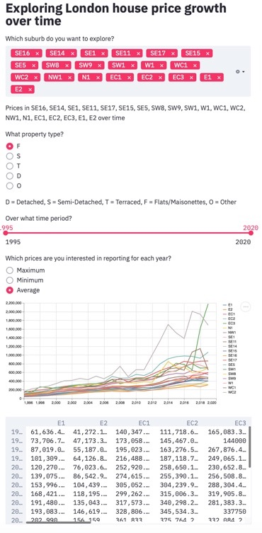

# House Prices in Inner City London

A short analysis by Courtney Irwin

## About the project

This project is a simple personal 
project to practise my data analysis skills, explore some 
popular dashboard libraries, and undertake some research for my
potential first home purchase next year in a particularly 
data science geeky way.

## Exploring London house price data

### Initial motivation for the project & challenges with the Zoopla API

The inspiration for this project initially came from exploring the 
rich information displayed on the Zoopla property website.  I was 
keen to work with the eager to play with the data available.  After a 
google search I was thrilled to discover than there was an API available 
for this data.  I applied a couple of times for access, but my requests 
went unanswered.  Some chat rooms suggested this was a common experience
amongst other developers.   

### National Land Registry data

As a replacement for this, I used the UK National Land Registry data for Price 
Paid, available from:  

https://www.gov.uk/government/collections/price-paid-data

Specifically, I've linked to the following data (see config file to update link):
http://prod.publicdata.landregistry.gov.uk.s3-website-eu-west-1.amazonaws.com/pp-complete.csv

## Installation and Setup

**Clone and setup requirements**

TODO

**Configurations**

The configuration file (config.json) is found in the 00_utils folder.
It contains the following configurable variable:
* RAW_DATA_INPUT_FILE_PATH: the location of the raw data file.  
* RAW_DATA_INPUT_FILE_HEADINGS: the heading for the file above.
* POSTCODES_OF_INTEREST: a list of the postcodes of interest
* OUTLIERS_DEF_SD: The definition of an outlier in the format of 'number of standard deviations from the mean'.


## About the Repository

The repo is organised into the following stages:
* 00_utils
* 01_data
* 02_preprocessing
* 03_analysis
* 04_plotting

### 00_utils

**config.json**

This file contains the system global variables for the analysis, 
including:
* RAW_DATA_FILE_PATH:The variable pointing to the raw data file you want 
to analyse (currently pointed at the web address for the land registry complete (all years)
price paid data)
* RAW_DATA_FILE_HEADINGS: The headings associated with the file above
* POSTCODES_OF_INTEREST: The list of UK postcodes to analyse with the data

### 01_data

This file contains all the data files created by the programme.

### 02_preprocessing

This file contains the scripts to extract the postcodes of interest from the 
large raw data file, clean the data, and write it locally to smaller, more quickly accessed, files.

It does the following:
* Reads the complete CSV file
* Extracts only the postcodes of interest
* Splits the 'year' from the 'date of transfer' field into a new column
* Writes a 'processed' csv file for each postcode of interest

This process takes approximately 70 mins (depending on your internet speed) to read the large raw 
dataframe from the website, and about a minute to clean and write a file for each postcode of interest. 

You should aim to list out a comprehensive enough postcode list so 
you only need to do this once.  

### 03_analysis

**Postcode Statistics by Year**

This analysis produces a dataframe with the min, max and mean of house prices by suburb 
for each year in the dataset. 

The function (postcode_stats_by_year()):
* Reads the preprocessed postcode CSV 
files output by the preprocessing fuction, for the postcodes of interest
(as listed in the config file).
* Removes outliers (according to the definition in the configuation file)
* Writes a csv to the 01_data folder in the format: 'postcode', 'year', 'property_type', 'max_price', 
'min_price', 'avg_price'


### 04_plotting

I've experimented with streamlit as a way to visually analyse and present 
the result of the analysis.

To run this, enter the following into terminal:
```
streamlit run 04_plotting/streamlit_plotting.py
```


<p align="center">

</p>

## Deploying the dashboard to AWS

To deploy the streamlit app, I followed the instructions on this website:
https://blog.jcharistech.com/2019/10/29/how-to-deploy-streamlit-apps-on-aws-ec2/

In a nutshell, I did the following:
1) Created a new AWS instance, using a Linux AMI, on the free tier.  
2) Set in inbound rules to enable TCP port 8501 to be access from anywhere.
3) SSH'ed into the ec2
4) Installed the latest python version
5) Installed git
6) Cloned this repo to the EC2
7) Installed streamlit (python3 -m pip install streamlit --user)

Once setup and installation were complete, I needed to download the data to the ec2, 
and run the preprocessing and analysis scripts.

cd into 02_preprocessing and run:

```
python3 preprocessing.py
```


Once complete, cd into the 04_plotting folder, and run:
```
streamlit run streamlit_plotting.py
```
